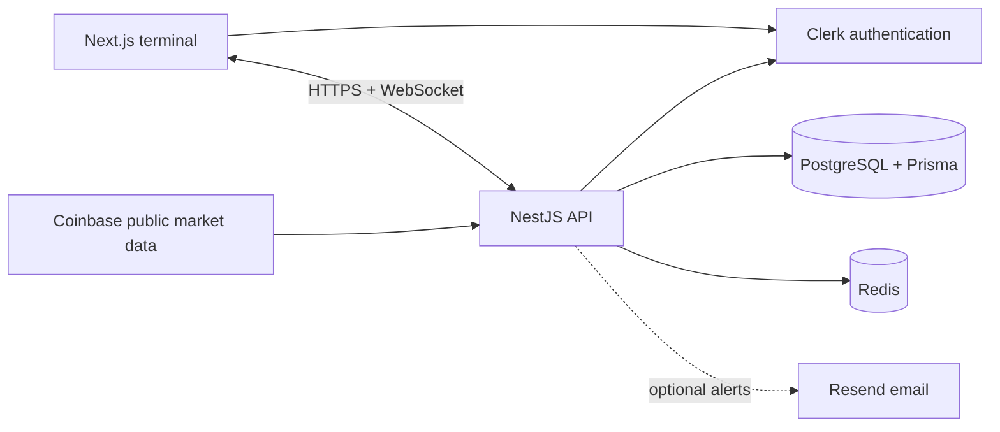

# Excess

[](https://github.com/Shreyas2004wagh/Excess/actions/workflows/ci.yml)

**A real-time paper-trading terminal for learning how orders, positions, and risk interact.** Sign up, receive **$10,000 in virtual USD**, follow BTC-USD and ETH-USD, place simulated trades, and watch your portfolio update as prices move.

> [!IMPORTANT]
> Excess is a simulation. It does not hold funds, connect to a brokerage account, or place orders on an exchange. Its fills, spread, slippage, margin, and liquidation rules are teaching models—not predictions of real execution.

## What you can do

| Area                | Included today                                                                                                                                        |
| ------------------- | ----------------------------------------------------------------------------------------------------------------------------------------------------- |
| Trading terminal    | Live five-minute candlesticks, watchlist, market/limit/stop orders, stop-loss and take-profit OCO protection                                          |
| Portfolio & risk    | Long/short positions, 1×/2×/5×/10× leverage, live P/L and equity, margin warnings, automatic liquidation, negative-balance protection                 |
| Safe exits          | Full reduce-only position close with version checks, idempotent retries, and confirmation of pending orders that could reopen exposure                |
| Insights            | Execution history, realized-performance metrics, UTC date-filtered reports, CSV export                                                                |
| Alerts & operations | One-shot price alerts, durable in-app notifications, optional email delivery, administrator audit explorer, rate limiting, health checks, and metrics |

The UI is responsive across desktop and mobile. Authentication uses Clerk email/password or Google; account balances and trading records live in PostgreSQL, not in the identity provider.

## Architecture

Excess is a **modular monolith**. The browser and API deploy separately, but trading, risk, alerts, reporting, and administration remain modules in one NestJS application.



| Path                      | Responsibility                                      |
| ------------------------- | --------------------------------------------------- |
| `apps/web`                | Next.js 16, React, Tailwind CSS, Lightweight Charts |
| `apps/api`                | NestJS HTTP/WebSocket API and business modules      |
| `packages/database`       | Prisma schema, migrations, and shared client        |
| `packages/trading-engine` | Deterministic position and order calculations       |
| `packages/risk-engine`    | Margin and account-risk calculations                |
| `packages/shared-types`   | Browser/API contracts                               |

PostgreSQL is authoritative for accounts, balances, orders, trades, positions, alerts, and the financial ledger. Redis caches market-data snapshots and backs rate limiting; the NestJS WebSocket gateway sends live updates to terminals. The public Coinbase feed provides live quotes and candles; `MARKET_DATA_PROVIDER=mock` provides deterministic development data.

## Run locally

You need **Node.js 22+**, Corepack/pnpm, Docker, and a [Clerk development application](https://clerk.com/docs/nextjs/getting-started/quickstart). The database and Redis ports in `docker-compose.yml` must be free.

1. Install dependencies and start the local data services:

   ```bash
   corepack enable
   corepack pnpm install
   cp .env.example .env
   docker compose up -d postgres redis
   corepack pnpm db:generate
   corepack pnpm db:deploy
   ```

2. Put your **development** Clerk keys in the git-ignored `apps/web/.env.local`:

   ```dotenv
   NEXT_PUBLIC_CLERK_PUBLISHABLE_KEY=<your development publishable key>
   CLERK_SECRET_KEY=<your development secret key>
   ```

   Enable email/password in Clerk. Enable Google there too if you want to test social sign-in. The API reads this local file as well as the root `.env`; never commit real keys.

3. Start both applications:

   ```bash
   corepack pnpm dev
   ```

Open [localhost:3000](http://localhost:3000), create an account, then visit `/terminal`. The first authenticated API access creates one demo account and one immutable $10,000 opening-credit ledger entry. The API runs on [localhost:4000](http://localhost:4000/api/v1/health); `/api/v1/health/ready` additionally checks PostgreSQL, Redis, and the market feed. If you cannot reach Coinbase during local development, set `MARKET_DATA_PROVIDER=mock` in `.env` and restart the API.

## How the simulation behaves

- A market buy starts from the **ask**; a market sell starts from the **bid**. Market and triggered stop fills add a fixed **2 bps adverse move**, rounded to the instrument tick. A move smaller than a tick can round to zero. Limit fills do not add slippage. Trade history records quoted half-spread and realized slippage separately.
- Order placement and full position closing are idempotent. A close is reduce-only and checks the position version, so a stale confirmation cannot accidentally reverse exposure. Pending entry orders remain active after a close and may open a new position later.
- Equity is `balance + unrealized P/L`; free margin is `equity − used margin`. A warning starts at a 100% margin level and automatic liquidation starts at 50%. Negative-balance protection floors a demo account at zero after a gap loss.
- Reports and performance are derived from executions and the immutable financial ledger. Report filters use inclusive UTC dates and an execution-time cutoff for pagination; the cutoff is **not** a persisted database snapshot.

Prices can change between preview and execution. The simulator does not model real order-book depth, exchange fees, funding, latency, or actual liquidity. Do not use its results as trading or financial advice.

## API at a glance

All trading, reporting, and administration routes require a Clerk bearer token. Responses serialize monetary values as decimal strings.

| Route                                                 | Purpose                                          |
| ----------------------------------------------------- | ------------------------------------------------ |
| `POST /api/v1/session/bootstrap`                      | Provision or load the authenticated demo account |
| `GET /api/v1/market-data/instruments`                 | Supported instruments and quotes                 |
| `GET /api/v1/market-data/instruments/:symbol/candles` | Five-minute candle history                       |
| `POST /api/v1/trading/orders`                         | Place market, limit, or stop orders              |
| `POST /api/v1/trading/positions/:positionId/close`    | Version-checked full position close              |
| `GET /api/v1/trading/portfolio`                       | Account, equity, risk, and positions             |
| `GET /api/v1/trading/trades`                          | Cursor-paginated execution history               |
| `GET /api/v1/reports/trading`                         | Date-filtered results and executions             |
| `GET /api/v1/reports/trading/export`                  | Full-range CSV export (10,000-row limit)         |
| `GET /api/v1/notifications`                           | In-app alert notifications                       |

The public liveness endpoint is `GET /api/v1/health`; readiness is `GET /api/v1/health/ready`. Administrators also have `/api/v1/admin/*` endpoints for operations, audit search, and failed-delivery retries.

## Tests and checks

With PostgreSQL and Redis running, use:

```bash
corepack pnpm format:check
corepack pnpm lint
corepack pnpm typecheck
corepack pnpm test
corepack pnpm build
```

`corepack pnpm test:e2e` runs authenticated Playwright checks in Chromium. It needs the local Clerk development keys above and `E2E_CLERK_USER_EMAIL` set to a dedicated Clerk test user; the suite uses that one account and runs with one worker. `corepack pnpm test:load` runs the k6 API profile with `K6_AUTH_TOKEN` set to a short-lived Clerk session token. Do not use a production user or token for load testing.

GitHub Actions runs formatting, lint, types, unit/integration tests, production builds, Playwright, and deployment-artifact checks on `main`.

## Deployment

**The repository contains deployment configuration, not a verified public deployment.** Run a staging release and smoke-test authentication, live prices, order execution, position closing, and WebSockets before inviting users.

1. Set up a [Railway project](https://docs.railway.com/cli) for the API, PostgreSQL, and Redis. Review `.railway/railway.ts` with `railway config plan` and apply it with `railway config apply` only after checking resources and cost. Install the Railway CLI separately; the `railway` package in this repo is the Infrastructure-as-Code library, not the CLI. The API Dockerfile is at the repository root, and Railway runs Prisma migrations before deployment.
2. Import the repository into [Vercel](https://vercel.com/docs/monorepos) for the web app, using the repository root and `vercel.json`. Set `NEXT_PUBLIC_API_URL` and `NEXT_PUBLIC_WS_URL` to the deployed API origins, and set Railway's `WEB_ORIGIN` to the final web origin.
3. Create a [Clerk production instance](https://clerk.com/docs/guides/development/deployment/production). Configure its production keys, domain, Google OAuth credentials, and production webhook endpoint/signing secret. Development keys are not production credentials.
4. Configure `METRICS_BEARER_TOKEN` and either set valid Resend credentials (`RESEND_API_KEY`, `ALERT_EMAIL_FROM`) or change `EMAIL_PROVIDER` to `disabled`. Verify `/api/v1/health/ready`, sign-up, trading, alerts, and admin access after release.

See `.env.example` for the full configuration surface. Never copy development database passwords or Clerk keys into a public deployment.

## Project status

The paper-trading MVP is implemented for BTC-USD and ETH-USD. A green CI run and a successful staging smoke test are still required before calling a hosted release production-ready. Excess remains intentionally a modular monolith; there are no microservices to deploy or coordinate.

## License

No license has been selected or added yet.
